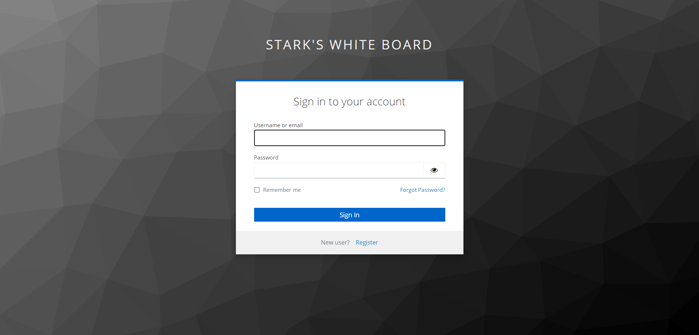
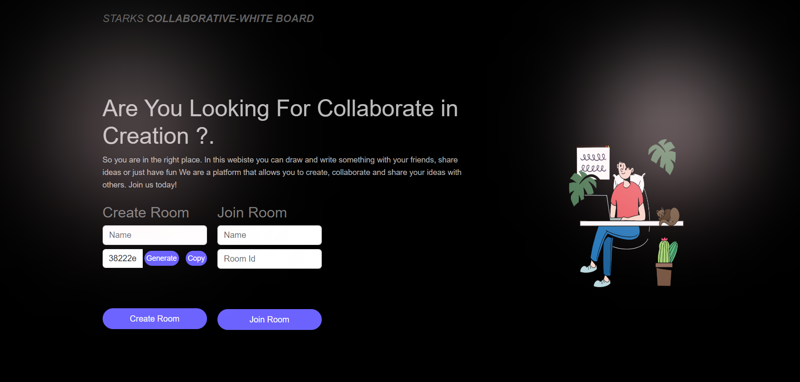
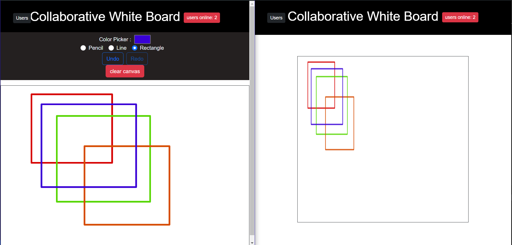

# Stark's Collaborative Whiteboard Project

Collaborative Whiteboard is a web application that allows users to collaboratively draw and share their ideas in real-time. The project utilizes technologies such as Keycloak for authentication, Socket.IO for real-time communication, React for the frontend, and Node.js with Express for the backend.

## Features

- **Real-time Collaboration:** Users can draw on the whiteboard simultaneously, and changes are reflected in real-time for all connected users.
- **Authentication:** Secure authentication using Keycloak to ensure only authorized users can access the whiteboard.
- **Drawing Tools:** Provides various drawing tools such as pencil, line, and rectangle to create drawings with ease.
- **Download Drawings:** Users can download their drawings as PNG images for offline use or sharing.

## Technologies Used

- **Frontend:**

  - React: JavaScript library for building user interfaces.
  - Socket.IO: Real-time communication library for web applications.
  - HTML/CSS: Markup and styling for the user interface.

- **Backend:**
  - Node.js: JavaScript runtime environment.
  - Express: Web application framework for Node.js.

## Screenshots

### Authentication with Keycloak

### Whiteboard Interface

### Real-time Collaboration

## Usage

1. Clone the repository.
2. Install dependencies using `npm install`.
3. Start the backend server using `npm start` in the server directory.
4. Start the frontend development server using `npm start` in the client directory.
5. Access the application in your browser at `http://localhost:3000`.

## Credits

This project is created by [Your Name]. Feel free to contribute by submitting bug reports, feature requests, or pull requests.

Happy Collaborating! 🎨✨
